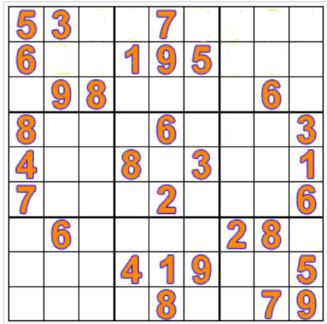
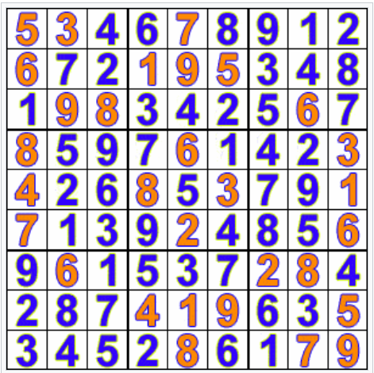

## HATIRLATMA

Katkıda bulunmak istiyorsanız, lütfen aşağıdaki adımları takip edin:

1. Projeyi forklayın
2. Kendi dalınızı oluşturun (`git checkout -b ozellik/dal-adi`)
3. Çözmek istediğiniz algoritma dizinine geliniz.(algorithm-1,algorithm-2 vb.) Bu dizinde karşınıza programlama dilleri klasörleri çıkacaktır. Çözüm yapacağınız programlama dilinin dosya dizinine gelin. ( C#,Rust vb.) 
4. İlgili algoritma için çözümünüzü repo içerisinde kaç tane çözüm varsa ona göre isimlendirin. Eğer 2 adet çözüm varsa kendi çözümünüzü "solution-3.cs" şeklinde kaydedebilirsiniz.Bu numaralandırma şekliyle çözümleri daha derli toplu tutmayı hedefliyoruz. Farklı isimlendirmeler ile gönderilen PR 'lar otomatik olarak reddedilecektir.
6. Değişikliklerinizi commit edin (`git commit -am 'Değişiklikleri açıklayan mesaj'`)
7. Dalınıza push yapın (`git push origin ozellik/dal-adi`)
8. Bir Pull Request oluşturun

## SORU 

9 x 9'luk bir sudoku çözecek algoritma yazalım.

9 x 9'luk sudoku 3 x 3'lük 9 kareden oluşur. Sudoku'unun tüm satır ve sütunlarıyla, 
3 x 3'lük karelerinin içinde 1'den 9'a kadarki rakamlardan herbirinin mutlaka bulunması halinde çözüm elde edilmiş olur.

input 9 x 9'luk iki boyutlu bir array şeklindedir:

[ [3, 0, 6, 5, 0, 8, 4, 0, 0],\
&ensp;[5, 2, 0, 0, 0, 0, 0, 0, 0],\
&ensp;[0, 8, 7, 0, 0, 0, 0, 3, 1],\
&ensp;[0, 0, 3, 0, 1, 0, 0, 8, 0],\
&ensp;[9, 0, 0, 8, 6, 3, 0, 0, 5],\
&ensp;[0, 5, 0, 0, 9, 0, 6, 0, 0],\
&ensp;[1, 3, 0, 0, 0, 0, 2, 5, 0],\
&ensp;[0, 0, 0, 0, 0, 0, 0, 7, 4],\
&ensp;[0, 0, 5, 2, 0, 6, 3, 0, 0] ]

array içindeki sıfırlar boş kutucukları göstermektedir.

**Example 1**  

 

**Girdi:** 

[ [5, 3, 0, 0, 7, 0, 0, 0, 0],\
&ensp;[6, 0, 0, 1, 9, 5, 0, 0, 0],\
&ensp;[0, 9, 8, 0, 0, 0, 0, 6, 0],\
&ensp;[8, 0, 0, 0, 6, 0, 0, 0, 3],\
&ensp;[4, 0, 0, 8, 0, 3, 0, 0, 1],\
&ensp;[7, 0, 0, 0, 2, 0, 0, 0, 6],\
&ensp;[0, 6, 0, 0, 0, 0, 2, 8, 0],\
&ensp;[0, 0, 0, 4, 1, 9, 0, 0, 5],\
&ensp;[0, 0, 0, 0, 8, 0, 0, 7, 9] ]
 

**Çıktı:** 1   

 

[ [5, 3, 4, 6, 7, 8, 9, 1, 2],\
&ensp;[6, 7, 2, 1, 9, 5, 3, 4, 8],\
&ensp;[1, 9, 8, 3, 4, 2, 5, 6, 7],\
&ensp;[8, 5, 9, 7, 6, 1, 4, 2, 3],\
&ensp;[4, 2, 6, 8, 5, 3, 7, 9, 1],\
&ensp;[7, 1, 3, 9, 2, 4, 8, 5, 6],\
&ensp;[9, 6, 1, 5, 3, 7, 2, 8, 4],\
&ensp;[2, 8, 7, 4, 1, 9, 6, 3, 5],\
&ensp;[3, 4, 5, 2, 8, 6, 1, 7, 9] ]
 

**Example 2**  

**Girdi:** 

[ [ 3, 0, 6, 5, 0, 8, 4, 0, 0 },\
&ensp;[ 5, 2, 0, 0, 0, 0, 0, 0, 0 },\
&ensp;[ 0, 8, 7, 0, 0, 0, 0, 3, 1 },\
&ensp;[ 0, 0, 3, 0, 1, 0, 0, 8, 0 },\
&ensp;[ 9, 0, 0, 8, 6, 3, 0, 0, 5 },\
&ensp;[ 0, 5, 0, 0, 9, 0, 6, 0, 0 },\
&ensp;[ 1, 3, 0, 0, 0, 0, 2, 5, 0 },\
&ensp;[ 0, 0, 0, 0, 0, 0, 0, 7, 4 },\
&ensp;[ 0, 0, 5, 2, 0, 6, 3, 0, 0 } ]

**Çıktı:** 1   

[ [3, 1, 6, 5, 7, 8, 4, 9, 2],\
&ensp;[5, 2, 9, 1, 3, 4, 7, 6, 8 ],\
&ensp;[4, 8, 7, 6, 2, 9, 5, 3, 1 ],\
&ensp;[2, 6, 3, 4, 1, 5, 9, 8, 7 ],\
&ensp;[9, 7, 4, 8, 6, 3, 1, 2, 5 ],\
&ensp;[8, 5, 1, 7, 9, 2, 6, 4, 3 ],\
&ensp;[1, 3, 8, 9, 4, 7, 2, 5, 6 ],\
&ensp;[6, 9, 2, 3, 5, 1, 8, 7, 4 ],\
&ensp;[7, 4, 5, 2, 8, 6, 3, 1, 9 ] ]

**Açıklama**

Her satır, her sütun ve her 3 x 3'lük kare içinde her bir rakamdan yalnızca bir tane bulunuyor.
## Lisans

Bu proje MIT Lisansı ile lisanslanmıştır - daha fazla bilgi için [LİSANS](LİSANS) dosyasına bakın.

